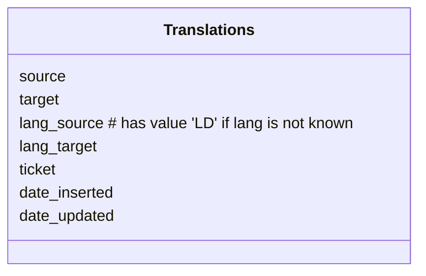

# SOILWISE Util

API with various Util Methods:

- [Feeds](#feeds-api); lets users browse through various soil mission project feeds
- [Translate callback](#translate-callback); a callback endpoint for EU translation service
- [Record validate](#record-validation); an api to validate the status of a record
- [Version hisotry](#version-history); API to retrieve previous versions of records 

And [installation instructions](#installation).


## Feeds API

News feeds of the soil mission projects are harvested into a database, this API enables to browse through the feeds. Feeds are ordered by date.

Use params `limit` and `offset` to paginate through the results

## Translate callback

Some records arrive in a local language, we aim to capture at least main properties for the record in english: title, abstract, keywords, lineage, usage constraints. We use EU translate service, which returns a translated string to this API endpoint.

Features
- the EU translation service is used, this service returns a asynchronous response to an API endpoint (callback)
- the callback populates the database, next time the translation is available
- make sure that frontend indicates if a string has been machine translated, with option to flag as inappropriate

EU API documentation <https://language-tools.ec.europa.eu/>

A token for the service is available, ask Nick, RobK or Paul if you need it.



### Error codes

Error codes of the EU tranlate service start with -, following error codes are of interest

| code   | description |
| ---    | --- | 
| -20001 | Invalid source language | 
| -20003 | Invalid target language(s) | 
| -20021 | Text to translate too long | 
| -20028 | Concurrency quota exceeded | 
| -20029 | Document format not supported | 
| -20049 | Language can not be detected | 

## Record validation

Runs some tests on arbitrary PID (DOI, handle.net, UUID)

Tests:
- http://localhost:8000/pid/status/foo
- http://localhost:8000/pid/status/10.1002/15-1100 (in soilwise)
- http://localhost:8000/pid/status/10.1603/ec10272 (not HE)
- http://localhost:8000/pid/status/10.3196/18642950146145209 (no relation)
- http://localhost:8000/pid/status/10.5281/zenodo.12189624 101017416 (not in soil)
- http://localhost:8000/pid/status/10.5281/zenodo.14733168 (in he project)

As part of the workflow you can also suggest a new record to be evaluated for inclusion by the
soilwise team.

POST http://localhost:8000/pid/suggest (doi, name, email)

Notice that only valid DOI's can be submitted.

## Version history

The API allows to retrieve the version history of a record, during the lifetime of SoilWise.

POST http://localhost:8000/history/{identifier}

The records are returned in their original format (json, xml, rdf).

## Installation

A database connection needs to be set up. You can configure the database connection in a .env file (or set environment variables).

```
POSTGRES_HOST=example.com
POSTGRES_PORT=5432
POSTGRES_DB=postgres
POSTGRES_USER=postgres
POSTGRES_PASSWORD=******
```
Dedicated parameters can be set to finetune the service

```
ROOT_URL to be set to the url where the application is hosted, for self reference
ROOTPATH to be set if the service does not run in the root folder
REC_URI  is the prefix to link to a record, it is concatenated with the doi. used in docs of the validation module
```

Install requirements

```
pip3 install -r requirements.txt
```

To run the API locally 

```
python3 -m uvicorn api:app --reload --host 0.0.0.0 --port 8000 
```
The FastAPI service runs on: [http://127.0.0.1:8000/]

To view the service of the FastAPI on [http://127.0.0.1:8000/]

## Container Deployment

Set environment variables in Dockerfile to enable database connection.

Run the following command:

```
docker run -p8000:8000 ghcr.io/soilwise-he/soilwise-util:latest
```

Navigate to https://localhost:8000/docs to see interactive documentation (swagger)

---
## SoilWise-he project

This work has been initiated as part of the [SoilWise-he](https://soilwise-he.eu) project. The project
receives funding from the European Union's HORIZON Innovation Actions 2022 under grant agreement No.
101112838. Views and opinions expressed are however those of the author(s) only and do not necessarily
reflect those of the European Union or Research Executive Agency. Neither the European Union nor the
granting authority can be held responsible for them.
