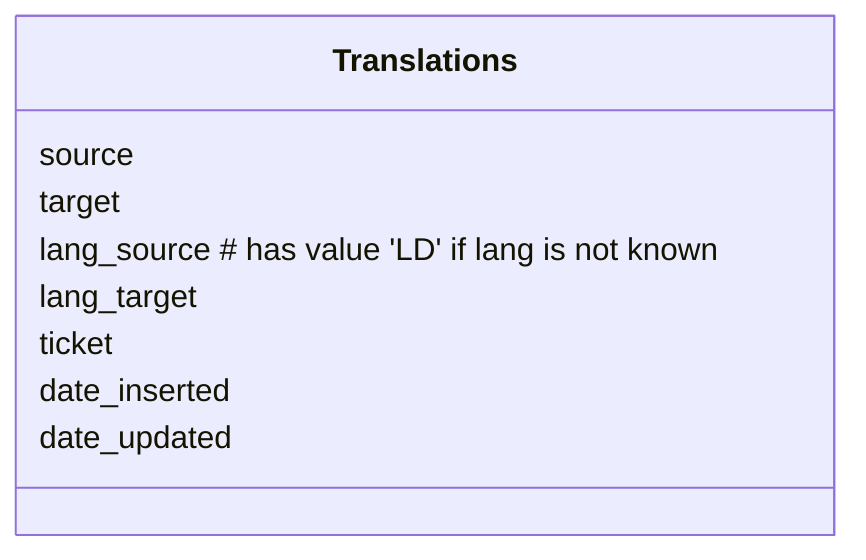

# SOILWISE Util

API with various Util Methods:

- [Feeds](#feeds-api); let's users browse through various soil mission project feeds
- [Translate callback](#translate-callback); a callback endpoint for EU translation service
- [Record validate](#record-validation); an api to validate the status of a record
- [Version hisotry](#version-history); API to retrieve previous versions of records 

And [installation instructions](#installation).


## Feeds API

News feeds of the soil mission projects are harvested into a database, this API enables to browse through the feeds. Feeds are ordered by date.

Use params `limit` and `offset` to paginate through the results

## Translate callback

Some records arrive in a local language, we aim to capture at least main properties for the record in english: title, abstract, keywords, lineage, usage constraints. We use EU translate service, which returns a translated string to this API endpoint.

Features
- the EU translation service is used, this service returns a asynchronous response to an API endpoint (callback)
- the callback populates the database, next time the translation is available
- make sure that frontend indicates if a string has been machine translated, with option to flag as inappropriate

EU API documentation <https://language-tools.ec.europa.eu/>

A token for the service is available, ask Nick, RobK or Paul if you need it.



### Error codes

Error codes of the EU tranlate service start with -, following error codes are of interest

| code   | description |
| ---    | --- | 
| -20001 | Invalid source language | 
| -20003 | Invalid target language(s) | 
| -20021 | Text to translate too long | 
| -20028 | Concurrency quota exceeded | 
| -20029 | Document format not supported | 
| -20049 | Language can not be detected | 

## Record validation

Runs some tests on arbitrary DOI

Tests:
- http://localhost:8000/status/foo
- http://localhost:8000/status/10.1002/15-1100 (in soilwise)
- http://localhost:8000/status/10.1603/ec10272 (not HE)
- http://localhost:8000/status/10.3196/18642950146145209 (no relation)
- http://localhost:8000/status/10.5281/zenodo.12189624 101017416 (not in soil)
- http://localhost:8000/status/10.5281/zenodo.14733168 (in he project)
'
## Version history


## Installation

A database connection needs to be set up. You can configure the database connection in a .env file (or set environment variables).

```
OGCAPI_URL=https://example.com
OGCAPI_COLLECTION=example
POSTGRES_HOST=example.com
POSTGRES_PORT=5432
POSTGRES_DB=postgres
POSTGRES_SCHEMA=linky
POSTGRES_USER=postgres
POSTGRES_PASSWORD=******
```

Install requirements

```
pip3 install -r requirements.txt
```

```

To run the API locally 

```
python3 -m uvicorn api:app --reload --host 0.0.0.0 --port 8000 
```
The FastAPI service runs on: [http://127.0.0.1:8000/]

To view the service of the FastAPI on [http://127.0.0.1:8000/]

## Container Deployment

Set environment variables in Dockerfile to enable database connection.

Run the following command:

The app can be deployed as a container. 
A docker-compose file has been implemented.

Run ***docker-compose up*** to run the container

## Deploy `feeds` at a path

You can set `ROOTPATH` env var to run the api at a path (default is at root)

```
export ROOTPATH=/feeds
```


Navigate to /docs to see interactive documentation (swagger)


## CI/CD

A CI/CD configuration file is provided in order to create an automated chronological pipeline.
It is necessary to define the secrets context using GitLab secrets in order to connect to the database.

---

## Soilwise-he project

This work has been initiated as part of the Soilwise-he project. 
The project receives funding from the European Union’s HORIZON Innovation Actions 2022 under grant agreement No. 101112838.